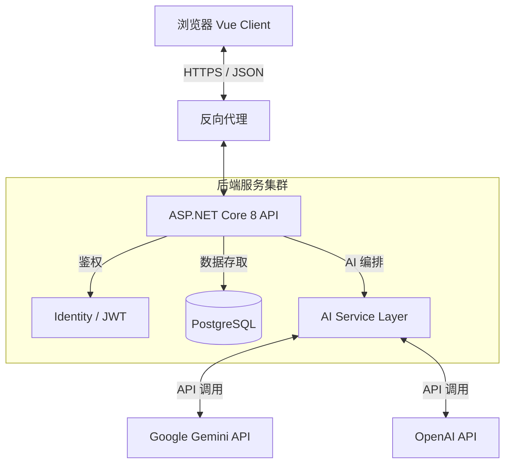

# DeepFlow 架构重构计划书

## 1. 项目摘要

本文档详细规划了将 DeepFlow 从目前的 **Client-side React SPA** 原型，重构为 **Vue.js 3 (前端) + .NET 8 (后端)** 的企业级 SaaS 架构。

**核心目标：**
将应用从单一的浏览器本地存储模式，转变为具备用户鉴权、云端数据同步、高可扩展 AI 服务编排能力的生产级应用。

---

## 2. 目标技术栈架构

### 2.1 技术选型对比

| 模块 | 当前 (Current) | 目标 (Target) | 优势说明 |
| :--- | :--- | :--- | :--- |
| **前端框架** | React 19 | **Vue 3 (Composition API)** | 更符合团队偏好，响应式系统更直观，心智负担低。 |
| **状态管理** | React Hooks / Context | **Pinia** | 模块化更强，类型推断更完善，代码结构更清晰。 |
| **后端框架** | 无 (纯前端) | **ASP.NET Core Web API (.NET 8)** | 高性能，强类型，企业级生态完善，易于维护。 |
| **数据库** | LocalStorage | **PostgreSQL (Prod) / SQLite (Dev)** | 数据的持久化、安全性、多端同步能力。 |
| **ORM** | 无 | **Entity Framework Core** | 开发效率高，LINQ 查询表达力强。 |
| **AI 集成** | 客户端直接调用 SDK | **服务端代理模式 (Backend Proxy)** | 隐藏 API Key，集中管理 Prompt，便于切换模型提供商。 |

### 2.2 系统架构图



---

## 3. 详细迁移阶段规划

### 第一阶段：后端基础建设 (.NET 8)

**目标：** 建立 API 骨架，实现数据存储和 AI 代理接口。

1.  **项目初始化**
    *   创建 `DeepFlow.Solution`。
    *   包含项目：`DeepFlow.Api` (WebAPI), `DeepFlow.Core` (领域模型), `DeepFlow.Infrastructure` (DB & AI)。
2.  **数据库设计 (Code First)**
    *   创建 `Essay` 实体（对应前端 `Essay` 类型）。
    *   创建 `EssayVersion` 实体（一对多关系）。
    *   配置 PostgreSQL 连接。
3.  **AI 服务层实现**
    *   将前端 `geminiService.ts` 逻辑迁移至 C#。
    *   实现 `IAIGenerator` 接口，支持依赖注入切换 Gemini/OpenAI。
    *   **安全升级**：API Key 移至服务器环境变量，不再暴露给前端。
4.  **API 接口开发**
    *   `POST /api/auth/login` (JWT 签发)
    *   `GET /api/essays` (获取列表)
    *   `POST /api/ai/completion` (统一 AI 接口)

### 第二阶段：前端重写 (Vue.js 3)

**目标：** 使用 Vue 生态重构 UI，对接后端 API。

1.  **项目脚手架**
    *   使用 `npm create vue@latest` 初始化。
    *   安装 `Pinia`, `Vue Router`, `Tailwind CSS`, `Axios`。
2.  **组件移植策略**
    *   `Dashboard.tsx` -> `views/Dashboard.vue`
    *   `Editor.tsx` -> `views/Editor.vue` (拆分为更小的子组件：`GhostOverlay.vue`, `PolishingMenu.vue`)。
    *   `History.tsx` -> `views/History.vue`
3.  **逻辑抽离 (Composables)**
    *   将 React Hooks 转换为 Vue Composables。
    *   例如：`useGhostText.ts` 负责防抖和 API 调用状态管理。
4.  **状态管理 (Pinia)**
    *   建立 `essayStore`：负责文章的 CRUD 和云端同步。
    *   建立 `authStore`：负责用户登录状态和 Token 管理。

### 第三阶段：数据迁移与上线

1.  **数据导入工具**
    *   在 Vue 应用首次启动时，检测 `localStorage` 中的旧数据。
    *   提供“一键同步到云端”功能，调用后端 API 批量上传旧文章。
2.  **部署架构**
    *   前端：Nginx 静态托管或 Vercel。
    *   后端：Docker 容器化部署至 Linux 服务器或 Azure App Service。

---

## 4. 核心代码重构示例

### 4.1 React Hook vs Vue Composable

**当前 (React):**
```typescript
// useGhostText (隐式逻辑在组件内)
useEffect(() => {
  const timer = setTimeout(() => triggerAI(), 1000);
  return () => clearTimeout(timer);
}, [content]);
```

**目标 (Vue 3 Composition API):**
```typescript
// composables/useGhostText.ts
import { ref, watch } from 'vue';
import { useDebounceFn } from '@vueuse/core';
import api from '@/api';

export function useGhostText(contentSource: Ref<string>) {
    const suggestions = ref([]);
    const isLoading = ref(false);

    const fetchSuggestions = useDebounceFn(async (text) => {
        isLoading.value = true;
        suggestions.value = await api.ai.getCompletion(text);
        isLoading.value = false;
    }, 1000);

    watch(contentSource, (newVal) => {
        fetchSuggestions(newVal);
    });

    return { suggestions, isLoading };
}
```

### 4.2 C# 后端 AI 控制器示例

```csharp
[ApiController]
[Route("api/ai")]
[Authorize] // 需要登录
public class AIController : ControllerBase
{
    private readonly IAIGenerator _aiService;

    public AIController(IAIGenerator aiService)
    {
        _aiService = aiService;
    }

    [HttpPost("inspiration")]
    public async Task<IActionResult> GenerateInspiration([FromBody] HintRequest req)
    {
        // Prompt 模板逻辑移至后端，前端无法查看 System Prompt
        var result = await _aiService.GenerateInspirationAsync(req.Hint);
        return Ok(result);
    }
}
```

## 5. 风险评估

1.  **数据丢失风险**：在从 LocalStorage 迁移到数据库的过程中，必须做好备份导出功能 (Export as JSON)。
2.  **API 延迟**：AI 请求经过后端代理会增加微小的网络延迟，需优化 C# 的 `HttpClient` 连接池。
